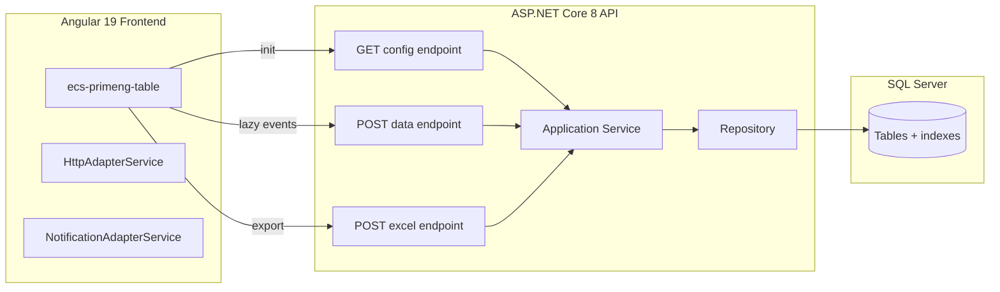
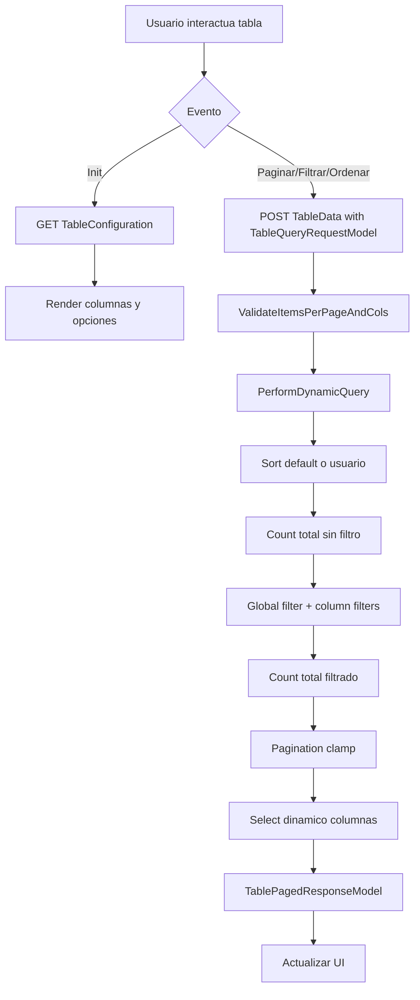

# Arquitectura y flujo

## Arquitectura de alto nivel

## Flujo de carga (lazy)

## Decisiones clave
- El frontend **no** carga todo el dataset.
- Toda paginación/filtro/orden se ejecuta en SQL vía `IQueryable`.
- El frontend solo envía `TableQueryRequestModel` y pinta respuesta.
- `RowID` (identificador único y estable; Guid recomendado) es obligatorio para features avanzadas.

## Regla de oro
Si hay que elegir entre “lógica en cliente” o “query en base de datos”, para tablas grandes gana base de datos.
