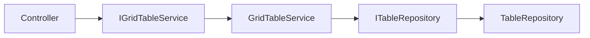

# Backend .NET 8

## Estructura recomendada (SOLID)

## Contrato mínimo de endpoints
1. `GET /{Tabla}/GetTableConfiguration`
   - Devuelve `TableConfigurationModel`.
2. `POST /{Tabla}/GetTableData`
   - Recibe `TableQueryRequestModel`.
   - Devuelve `TablePagedResponseModel`.

Opcional:
3. `POST /{Tabla}/GenerateExcel`
4. Endpoints para vistas (`GetViews`, `SaveViews`) si persistes en BD.

## DTO base de tabla
- Debe incluir `RowID: Guid` único.
- Toda columna que participe en tabla debe tener metadatos (`ColumnAttributes`).
- Si una columna no debe mostrarse pero sí viajar al front: `sendColumnAttributes: false`.

## Pipeline recomendado de servicio
1. Validar `PageSize` y columnas (`ValidateItemsPerPageAndCols`).
2. Construir `GetBaseQuery()` reutilizable (`AsNoTracking`).
3. Ejecutar query dinámica (`PerformDynamicQuery`).
4. Devolver response paginada.

## Buenas prácticas concretas
- `AsNoTracking()` para lectura.
- Índices SQL en columnas filtradas/ordenadas frecuentemente.
- Limitar `PageSize` a un set conocido (ej. 10, 25, 50, 100).
- Evitar lógica de negocio en controller.
- Añadir `CancellationToken` en endpoints y repositorio.
- Registrar logs estructurados (`RequestId`, endpoint, ms, filas).

## Seguridad
- Whitelist de columnas permitidas (evitar inyección por dinámicos).
- Validar `MatchMode` y operadores permitidos.
- Limitar longitud de `GlobalFilter`.

## Plantilla de servicio (resumen)
- `GetTableConfiguration()`: retorna metadatos.
- `GetTableData(input)`: valida y ejecuta query dinámica sobre `GetBaseQuery()`.
- `GetBaseQuery()`: proyección limpia desde entidades hacia DTO.

## Migración mental a .NET 8
Aunque el documento original usa .NET superior, el patrón y los contratos son válidos en .NET 8. Prioriza compatibilidad de paquetes NuGet y tests de integración.
