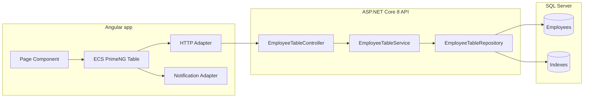
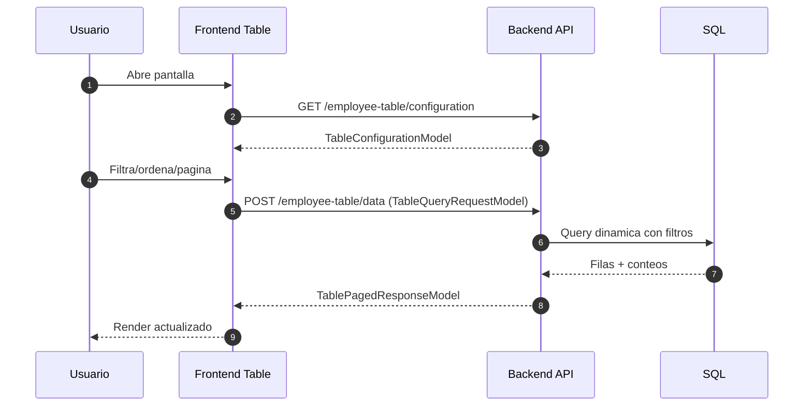
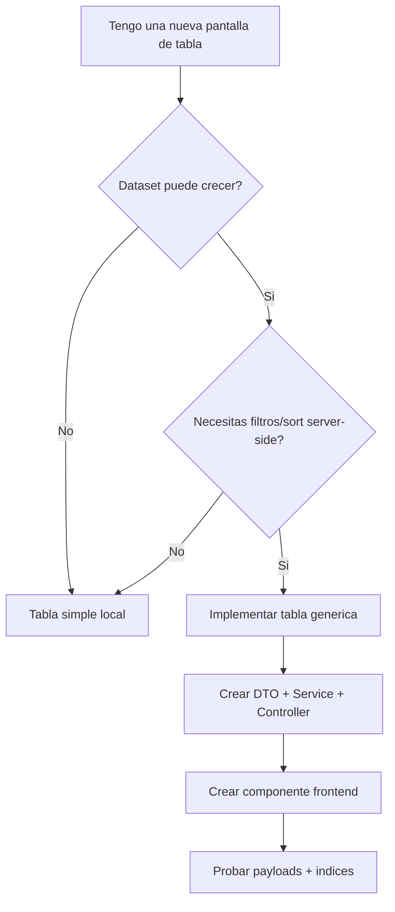

# Guia maestra implementacion repetible (.NET 8 + Angular 14/19)

> Esta guia esta pensada para copiar/pegar una implementacion real de tabla generica y poder repetirla muchas veces con bajo coste de mantenimiento.

## 1. Objetivo

Implementar una tabla que:
- Renderice rapido en frontend.
- Delegue filtros/orden/paginacion a base de datos.
- Sea reusable en multiples pantallas.
- Mantenga buenas practicas SOLID y KISS.

## 2. Cuando usar esta tabla y cuando no

### Recomendado (SI)
- Dataset mediano/grande (miles o millones de filas).
- Reglas de filtrado/orden complejas.
- Necesitas columnas dinamicas, vistas guardadas o export.
- Vas a reutilizar el patron en varias entidades.

### No recomendado (NO)
- Tablas pequenas (ej. 20-100 filas estaticas).
- Casos donde todo vive en memoria sin backend.
- UIs muy simples donde una tabla nativa cubre el caso.

## 3. Arquitectura completa



## 4. Flujo runtime (obligatorio entender)



## 5. Obligatorio vs opcional

### Backend obligatorio
- Endpoint GET configuracion.
- Endpoint POST datos.
- DTO con propiedad `RowID` unica y estable (Guid recomendado, no obligatorio).
- Metadatos de columnas con `ColumnAttributes`.
- Validacion de `pageSize` y columnas.
- Query sobre `IQueryable` (sin materializar antes).

### Frontend obligatorio
- Implementar `ECSPrimengTableHttpService`.
- Implementar `ECSPrimengTableNotificationService`.
- Construir opciones con `createTableOptions(...)`.
- Definir `urlTableConfiguration` y `urlTableData`.

### Opcional
- Export Excel.
- Vistas guardadas en BD/local/session.
- Botones de accion por fila.
- Predefined filters.

## 6. Diferencias Angular 14 vs Angular 19

## 6.1 Angular 14 (con AppModule)
- El registro de providers se hace en `app.module.ts`.
- El componente puede ser no-standalone.
- Mantienes el mismo patron de adapters y `createTableOptions`.

Ejemplo conceptual:

```ts
@NgModule({
  declarations: [AppComponent, EmployeeTablePageComponent],
  imports: [BrowserModule, HttpClientModule, ECSPrimengTable],
  providers: [
    MessageService,
    { provide: ECSPrimengTableHttpService, useClass: TableHttpAdapterService },
    { provide: ECSPrimengTableNotificationService, useClass: TableNotificationAdapterService }
  ],
  bootstrap: [AppComponent]
})
export class AppModule {}
```

## 6.2 Angular 19 (standalone + app.config)
- Registro de providers en `app.config.ts`.
- Componentes standalone.
- Mismo concepto de adapters.

```ts
export const appConfig: ApplicationConfig = {
  providers: [
    provideHttpClient(),
    MessageService,
    { provide: ECSPrimengTableHttpService, useClass: TableHttpAdapterService },
    { provide: ECSPrimengTableNotificationService, useClass: TableNotificationAdapterService }
  ]
};
```

## 7. Ejemplo completo correlacionado (Employee)

## 7.1 Backend

### DTO
```csharp
public sealed class EmployeeTableDto
{
    [ColumnAttributes(sendColumnAttributes: false)]
    public Guid RowID { get; set; }

    [ColumnAttributes("Usuario", canBeGlobalFiltered: true)]
    public string Username { get; set; } = string.Empty;

    [ColumnAttributes("Salario", dataType: DataType.Numeric, dataAlignHorizontal: DataAlignHorizontal.Right)]
    public decimal Salary { get; set; }

    [ColumnAttributes("Fecha nacimiento", dataType: DataType.Date)]
    public DateTime? BirthDate { get; set; }

    [ColumnAttributes("Estado", filterPredefinedValuesName: "employmentStatus")]
    public string EmploymentStatus { get; set; } = string.Empty;

    [ColumnAttributes("Casa", dataType: DataType.Boolean)]
    public bool HasHouse { get; set; }
}
```

### Service
```csharp
public sealed class EmployeeTableService : IEmployeeTableService
{
    private static readonly int[] AllowedPageSizes = [10, 25, 50, 100];

    public TableConfigurationModel GetTableConfiguration()
    {
        return EcsPrimengTableService.GetTableConfiguration<EmployeeTableDto>(
            allowedItemsPerPage: AllowedPageSizes,
            dateFormat: "dd/MM/yyyy HH:mm",
            dateTimezone: "+01:00",
            dateCulture: "es-ES",
            exportDateFormat: "dd/mm/yyyy hh:mm"
        );
    }

    public (bool success, string? error, TablePagedResponseModel? data) GetTableData(TableQueryRequestModel request)
    {
        if (!EcsPrimengTableService.ValidateItemsPerPageAndCols(request.PageSize, request.Columns?.ToList(), AllowedPageSizes))
            return (false, "PageSize o columnas invalidas", null);

        var result = EcsPrimengTableService.PerformDynamicQuery(
            inputData: request,
            baseQuery: BuildBaseQuery(),
            defaultSortColumnName: [nameof(EmployeeTableDto.Username)],
            defaultSortOrder: [ColumnSort.Ascending]
        );

        return (true, null, result);
    }
}
```

### Controller
```csharp
[ApiController]
[Route("api/employee-table")]
public sealed class EmployeeTableController : ControllerBase
{
    [HttpGet("configuration")]
    public ActionResult<TableConfigurationModel> GetConfiguration() => Ok(_service.GetTableConfiguration());

    [HttpPost("data")]
    public IActionResult GetData([FromBody] TableQueryRequestModel request)
    {
        var result = _service.GetTableData(request);
        if (!result.success) return BadRequest(new { message = result.error });
        return Ok(result.data);
    }
}
```

## 7.2 Frontend

### Adapter HTTP (obligatorio)
```ts
@Injectable({ providedIn: 'root' })
export class TableHttpAdapterService extends ECSPrimengTableHttpService {
  private readonly apiBaseUrl = 'https://localhost:5001/api/';

  constructor(private readonly http: HttpClient) {
    super();
  }

  handleHttpGetRequest<T>(servicePoint: string, responseType: 'json' | 'blob' = 'json') {
    return this.http.get<T>(`${this.apiBaseUrl}${servicePoint}`, {
      observe: 'response',
      responseType: responseType as 'json'
    });
  }

  handleHttpPostRequest<T>(servicePoint: string, data: any, httpOptions: HttpHeaders | null = null, responseType: 'json' | 'blob' = 'json') {
    return this.http.post<T>(`${this.apiBaseUrl}${servicePoint}`, data, {
      headers: httpOptions ?? undefined,
      observe: 'response',
      responseType: responseType as 'json'
    });
  }
}
```

### Componente
```ts
@Component({
  selector: 'app-employee-table-page',
  standalone: true,
  imports: [ECSPrimengTable],
  template: `<ecs-primeng-table [tableOptions]="tableOptions"></ecs-primeng-table>`
})
export class EmployeeTablePageComponent {
  tableOptions: ITableOptions = createTableOptions({
    urlTableConfiguration: 'employee-table/configuration',
    urlTableData: 'employee-table/data',
    globalFilter: { enabled: true, maxLength: 30 },
    header: { clearFiltersEnabled: true, clearSortsEnabled: true }
  });
}
```

## 8. Respuestas directas a tus dudas

## 8.1 En el front, tengo que mandar algun JSON de configuracion?
Si. Pero hay 2 niveles:
- Automatico por libreria (obligatorio): al cargar, el front hace GET a `urlTableConfiguration` y recibe `TableConfigurationModel`.
- De consulta de datos (obligatorio): en cada interaccion, manda `TableQueryRequestModel` en el POST de datos.

No necesitas crear un archivo JSON manual en frontend. Se genera desde `tableOptions` y desde el estado de la tabla.

## 8.2 La libreria necesita rowId con ese nombre exacto?
Respuesta corta:
- Nombre: practicamente si, usa `RowID` en backend y `rowID` en frontend.
- Tipo: no tiene que ser Guid por obligacion tecnica; tiene que ser unico, estable y no nulo.

Detalle importante:
- El ecosistema de ejemplos y helpers del paquete trabaja alrededor de `rowID` para seleccion y acciones por fila.
- Si cambias el nombre, te puedes encontrar fallos sutiles o mas codigo de adaptacion.
- Por mantenibilidad, estandariza siempre `RowID/rowID` aunque tu PK real tenga otro nombre.

Regla recomendada:
- Obligatorio funcional: identificador unico y estable por fila.
- Recomendado de implementacion: `RowID` con valor Guid.
- Aceptable: `RowID` basado en int/string si se mantiene estable y validas tus flujos de seleccion.

Ejemplo con PK int en DB sin romper nada:
```csharp
public sealed class Employee
{
  public int Id { get; set; } // PK real en DB
  public string Username { get; set; } = string.Empty;
}

public sealed class EmployeeTableDto
{
  [ColumnAttributes(sendColumnAttributes: false)]
  public int RowID { get; set; } // identificador de fila para la tabla

  [ColumnAttributes("Usuario", canBeGlobalFiltered: true)]
  public string Username { get; set; } = string.Empty;
}

// Mapping
RowID = x.Id;
```

Si prefieres Guid por estandar de proyecto, puedes mantener `Id` int como PK y agregar un `RowGuid` persistido para exponerlo como `RowID`.

## 8.3 Cuantos archivos necesito por cada tabla?
Minimo realista por tabla:
- Backend: 4 archivos.
  - DTO
  - Repository (interfaz + clase pueden ser 1 o 2 segun tu estilo)
  - Service (interfaz + clase pueden ser 1 o 2)
  - Controller
- Frontend: 1 archivo de pagina/componente por tabla.

Reusables (una sola vez para toda la app):
- Adapter HTTP.
- Adapter Notification.
- Configuracion global de providers.

## 8.4 Que ventajas tiene y cuando implementarla?
Ventajas:
- Escala mejor que filtrar en cliente.
- Menos memoria en navegador.
- Contrato uniforme para todas las tablas.
- Menos codigo repetido cuando crecen pantallas.

Implementarla cuando:
- La tabla vive de datos de BD y puede crecer.
- Quieres filtros/sort robustos y consistentes.

No implementarla cuando:
- Dataset siempre minimo y fijo.
- No necesitas filtros/orden server-side.

## 8.5 Pueden convivir varias tablas en el mismo componente?
Si, pueden convivir.

Buenas practicas:
- Cada tabla con su propio `tableOptions`.
- Cada tabla con endpoint propio o parametros de recurso.
- Evitar cargar todas a la vez al iniciar pantalla (lazy tabs/accordion).

## 8.6 No se sobrecarga la base de datos?
Puede pasar si se implementa mal, pero no por la libreria en si.

Para evitar sobrecarga:
- Indices en columnas filtradas/ordenadas.
- Limitar `pageSize`.
- Debounce de busqueda global.
- Evitar abrir 5 tablas a la vez en la misma vista.
- Monitorear p95/p99 de endpoint.

## 8.7 Como implementar imagenes, iconos y botones en filas?

### Botones por fila (obligatorio si hay acciones CRUD por fila)
Usa `rows.action.buttons` en `tableOptions`.

```ts
rowActionButtons: ITableButton[] = [
  {
    icon: 'pi pi-search',
    tooltip: 'Ver detalle',
    class: 'p-button-primary',
    action: (rowData) => this.openDetail(rowData.rowID)
  },
  {
    icon: 'pi pi-trash',
    tooltip: 'Eliminar',
    class: 'p-button-danger',
    enabledCondition: (rowData) => rowData.canBeDeleted === true,
    action: (rowData) => this.deleteRow(rowData.rowID)
  }
];

tableOptions: ITableOptions = createTableOptions({
  urlTableConfiguration: 'employee-table/configuration',
  urlTableData: 'employee-table/data',
  rows: {
    action: {
      header: 'Acciones',
      width: 150,
      frozen: true,
      buttons: this.rowActionButtons
    }
  }
});
```

### Iconos en celda (opcional)
Se implementa con `predefinedFilters` usando `icon`, `iconColor` o `iconStyle`.

```ts
readonly predefined: { [key: string]: IPredefinedFilter[] } = {
  syncStatus: [
    { value: 'OK', name: 'Sincronizado', displayTag: true, icon: 'pi pi-check', iconColor: '#16a34a' },
    { value: 'WARN', name: 'Advertencia', displayTag: true, icon: 'pi pi-exclamation-triangle', iconColor: '#d97706' },
    { value: 'ERR', name: 'Error', displayTag: true, icon: 'pi pi-times-circle', iconColor: '#dc2626' }
  ]
};
```

### Imagenes en celda (opcional)
Tambien con `predefinedFilters`, usando `imageURL` o `imageBlob`.

```ts
readonly predefinedImages: { [key: string]: IPredefinedFilter[] } = {
  profileState: [
    { value: 'OK', imageURL: 'https://cdn.example.com/status-ok.png', imageWidth: 18, imageHeight: 18 },
    { value: 'WARN', imageURL: 'https://cdn.example.com/status-warn.png', imageWidth: 18, imageHeight: 18 },
    { value: 'ERR', imageURL: 'https://cdn.example.com/status-err.png', imageWidth: 18, imageHeight: 18 }
  ]
};
```

Para que funcione, el valor del backend en la columna debe coincidir con `value` en cada opcion (`OK`, `WARN`, `ERR`, etc.).

Buenas practicas para celdas enriquecidas:
- No uses imagenes pesadas en tablas con muchas filas visibles.
- Si usas `imageURL`, cachea en CDN y controla expiracion.
- Para estados discretos, prefiere iconos frente a imagenes (menos peso).
- Mantiene tooltips cortos y utiles.

## 8.8 Esta guia ya esta perfecta o puede mejorar?
No existe una guia 100% perfecta para todos los proyectos. Esta guia ya esta en un nivel alto para implementar, pero siempre hay ajustes por contexto.

Cobertura actual (alta):
- Arquitectura y flujo completo.
- Backend y frontend minimos funcionales.
- Angular 14 vs 19.
- Contratos y payloads.
- Rendimiento base.
- FAQ de implementacion repetible.

Lo que aun depende de cada proyecto:
- Seguridad avanzada (rate limiting, auth por campo, auditoria).
- Estrategia de versionado API en entornos multi-equipo.
- Testing E2E de UI con Playwright/Cypress.
- Politicas de observabilidad (SLO/SLA, alertas).

Si quieres dejarla "cerrada de verdad" para tu equipo, agrega una seccion final con tus convenciones internas (nombres de endpoints, logging, y reglas de release).

## 9. Diagrama de decisiones de implementacion



## 10. Checklist final reutilizable

- [ ] DTO con `RowID` unico y estable (Guid recomendado).
- [ ] `ColumnAttributes` en todas las columnas visibles.
- [ ] Endpoint GET configuracion funcionando.
- [ ] Endpoint POST datos funcionando.
- [ ] Adapter HTTP registrado.
- [ ] Adapter Notification registrado.
- [ ] `createTableOptions` aplicado.
- [ ] Prueba real de filtros/sort/paginacion.
- [ ] Indices SQL en columnas criticas.
- [ ] Logs y metricas de rendimiento activas.

## 11. Estructura de carpetas sugerida para escalar

```text
backend/
  Tables/
    Employees/
      EmployeeTableDto.cs
      IEmployeeTableRepository.cs
      EmployeeTableRepository.cs
      IEmployeeTableService.cs
      EmployeeTableService.cs
      EmployeeTableController.cs

frontend/src/
  pages/
    employee-table-page/
      employee-table-page.component.ts
      employee-table-page.component.html
  shared/table/
    table-http-adapter.service.ts
    table-notification-adapter.service.ts
```

Con esta estructura, repetir una nueva tabla (Customers, Products, Invoices) es principalmente copiar la carpeta de Employees y ajustar mapeos/columnas.
