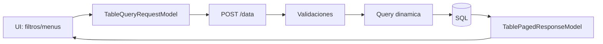
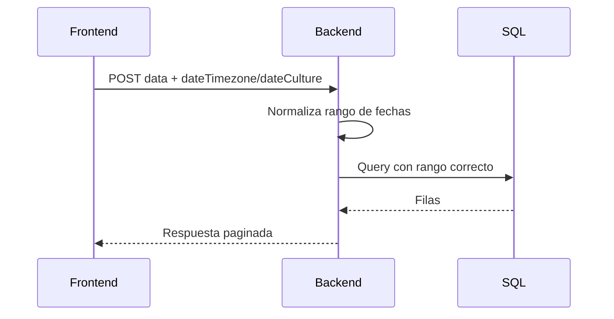

# Guia avanzada de filtros

> Esta guia aterriza filtros complejos de ECS PrimeNG Table para implementaciones reales en .NET 8 + Angular 14/19.

## 1) Modelo mental

La tabla no filtra en memoria: construye un `TableQueryRequestModel` y el backend aplica la logica sobre `IQueryable`.



## 2) Tipos de filtro y cuando usar cada uno

- Global filter:
  - Uso: busqueda rapida por keyword en columnas visibles.
  - Evitar: usarlo como reemplazo de filtros exactos.
- Column filter:
  - Uso: precision por campo (`equals`, `contains`, `gte`, etc.).
  - Recomendado para auditoria y trazabilidad.
- Predefined filters:
  - Uso: columnas con catalogo corto y conocido (estado, tipo, severidad).
  - Evitar en columnas con miles de valores distintos.
- List filters (valor separado por `;`):
  - Uso: celdas multi-valor (tags por registro).
  - Requiere convencion clara de separador y normalizacion.

## 3) Match modes recomendados por tipo

- Texto:
  - `contains`: busqueda flexible.
  - `equals`: cuando hay nomenclatura estricta.
  - `startsWith`: autocompletado o codigos prefijo.
- Numerico:
  - `equals`, `gt`, `gte`, `lt`, `lte`, `between`.
- Fecha:
  - `dateIs`, `dateBefore`, `dateAfter`, `between`.
  - Siempre revisar `dateTimezone` y `dateCulture`.
- Booleano:
  - `equals` con true/false.

## 4) AND/OR bien aplicado

Regla practica:
- OR para alternativas del mismo campo.
- AND para restricciones entre campos distintos.

Ejemplo correcto:
- `employmentStatus` = Full-time OR Contract.
- AND `salary` >= 30000.

```json
{
  "filter": {
    "employmentStatus": [
      { "matchMode": "equals", "operator": "OR", "value": "Full-time" },
      { "matchMode": "equals", "operator": "OR", "value": "Contract" }
    ],
    "salary": [
      { "matchMode": "gte", "operator": "AND", "value": 30000 }
    ]
  }
}
```

## 5) Filtros de fecha sin errores de zona horaria

Checklist obligatorio:
- Backend y frontend deben compartir `dateTimezone` y `dateCulture`.
- Definir formato de visualizacion y de export por separado.
- Probar casos limite: cambio de dia, DST, medianoche UTC.



## 6) Predefined filters (iconos, tags, imagenes)

Regla critica:
- `filterPredefinedValuesName` en backend debe coincidir con la key en `predefinedFilters` de frontend.
- `value` en `IPredefinedFilter` debe coincidir exactamente con el valor real en datos.

Ejemplo:

```ts
readonly predefined: { [key: string]: IPredefinedFilter[] } = {
  employmentStatus: [
    { value: 'Full-time', name: 'Full-time', displayTag: true, icon: 'pi pi-briefcase', iconColor: '#166534' },
    { value: 'Contract', name: 'Contract', displayTag: true, icon: 'pi pi-file', iconColor: '#1d4ed8' },
    { value: 'Intern', name: 'Intern', displayTag: true, icon: 'pi pi-star', iconColor: '#d97706' }
  ]
};
```

Para imagenes:
- Usa `imageURL` en catalogos cortos.
- Define `imageWidth` y `imageHeight` para estabilidad visual.
- Prefiere CDN y cache.

## 7) Seguridad de filtros en backend (obligatorio)

- Whitelist de columnas filtrables.
- Limitar longitud de `globalFilter`.
- Validar `matchMode` permitido por tipo de dato.
- Rechazar columnas desconocidas.

Pseudocodigo:

```csharp
var allowedColumns = new HashSet<string>
{
    "rowID", "username", "salary", "birthDate", "employmentStatus", "hasHouse"
};

if (request.Columns?.Any(c => !allowedColumns.Contains(c)) == true)
    return BadRequest("Columnas invalidas");
```

## 8) Rendimiento de filtros

Reglas que mas impactan:
- No ejecutar `ToList()` antes de filtrar.
- Indices en columnas de filtro/sort frecuentes.
- Limitar `pageSize` a valores definidos.
- Debounce en filtro global.
- Evitar 3-4 tablas disparando queries simultaneas sin necesidad.

## 9) Casos reales listos para prueba

## 9.1 Texto + numerico + orden

```json
{
  "page": 1,
  "pageSize": 25,
  "columns": ["rowID", "username", "salary", "employmentStatus"],
  "sort": [{ "field": "salary", "order": -1 }],
  "filter": {
    "username": [{ "matchMode": "contains", "operator": "AND", "value": "ser" }],
    "salary": [{ "matchMode": "gte", "operator": "AND", "value": 30000 }]
  },
  "globalFilter": null,
  "dateFormat": "dd/MM/yyyy HH:mm",
  "dateTimezone": "+01:00",
  "dateCulture": "es-ES",
  "exportDateFormat": "dd/mm/yyyy hh:mm"
}
```

## 9.2 Predefined multi valor

```json
{
  "filter": {
    "employmentStatus": [
      { "matchMode": "equals", "operator": "OR", "value": "Full-time" },
      { "matchMode": "equals", "operator": "OR", "value": "Part-time" }
    ]
  }
}
```

## 9.3 Fecha entre rango

```json
{
  "filter": {
    "birthDate": [
      { "matchMode": "between", "operator": "AND", "value": ["1990-01-01", "2000-12-31"] }
    ]
  },
  "dateTimezone": "+01:00",
  "dateCulture": "es-ES"
}
```

## 10) Troubleshooting rapido

- No devuelve resultados:
  - Revisar coincidencia exacta de `value` en predefined.
  - Revisar timezone/cultura en fecha.
- Devuelve lento:
  - Revisar indices y plan de ejecucion.
  - Reducir `pageSize`.
- Filtro no aplica en columna:
  - Revisar `ColumnAttributes` del DTO.
  - Revisar que el campo exista en la proyeccion final.

## 11) Definition of Done de filtros

- [ ] Filtros por columna correctos por tipo de dato.
- [ ] Global filter limitado y probado.
- [ ] Predefined filters alineados backend/frontend.
- [ ] Payloads de prueba ejecutados en Swagger.
- [ ] Tiempos p95 aceptables con dataset real.
- [ ] Sin errores de timezone en fechas.

## 12) Que faltaria despues de esta guia

Si ya aplicaste todo lo anterior, lo siguiente recomendado es:
- Guia de testing automatizado (unit + integracion + E2E).
- Guia de observabilidad (logs, metricas, trazas, alertas).
- Guia de seguridad operativa (rate limit, authz por accion/columna, auditoria).

Con esas 3 guias, tendrias un marco casi completo de implementacion + operacion.
