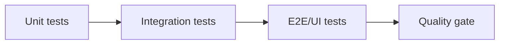
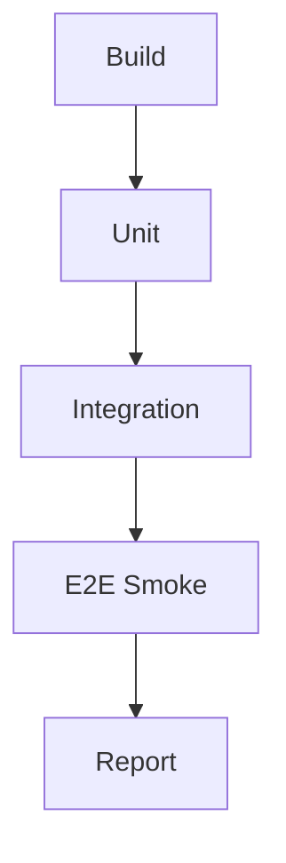

# Guia testing automatizado

> Objetivo: validar que la tabla generica funciona y no rompe al evolucionar endpoints, filtros, columnas o UI.

## 1) Estrategia recomendada

Tres capas de pruebas:
- Unit tests (rapidos): reglas de servicio y validaciones.
- Integration tests (con API): contratos reales de endpoints y payloads.
- UI tests (frontend): render, interaccion y comportamiento visible.



## 2) Piramide de testing sugerida

- 70% Unit tests.
- 20% Integration tests.
- 10% UI/E2E tests.

Meta:
- Unit: feedback en segundos.
- Integration: detectar roturas de contrato.
- UI/E2E: detectar regresiones visibles y wiring real.

## 3) Backend unit tests (.NET 8)

## 3.1 Que testear en servicio

- Validacion de `pageSize` permitido.
- Rechazo de columnas invalidas.
- Aplicacion de orden por defecto.
- Manejo de request vacio o null-safe.

## 3.2 Ejemplo xUnit (service)

```csharp
using ECS.PrimengTable.Models;
using FluentAssertions;
using Xunit;

public class EmployeeTableServiceTests
{
    [Fact]
    public void GetTableData_ShouldFail_WhenPageSizeIsInvalid()
    {
        // Arrange
        var repo = new FakeEmployeeTableRepository();
        var service = new EmployeeTableService(repo);

        var request = new TableQueryRequestModel
        {
            Page = 1,
            PageSize = 999,
            Columns = ["rowID", "username"]
        };

        // Act
        var result = service.GetTableData(request);

        // Assert
        result.success.Should().BeFalse();
        result.error.Should().NotBeNullOrWhiteSpace();
        result.data.Should().BeNull();
    }
}
```

## 4) Backend integration tests (API)

## 4.1 Que testear en endpoints

- GET configuration retorna 200 y contrato valido.
- POST data retorna 200 y payload esperado.
- Filtros alteran `totalRecords` correctamente.
- Respuesta conserva propiedades clave: `page`, `totalRecords`, `data`.

## 4.2 Ejemplo xUnit WebApplicationFactory

```csharp
using System.Net;
using System.Net.Http.Json;
using Xunit;

public class EmployeeTableApiTests : IClassFixture<CustomWebApplicationFactory>
{
    private readonly HttpClient _client;

    public EmployeeTableApiTests(CustomWebApplicationFactory factory)
    {
        _client = factory.CreateClient();
    }

    [Fact]
    public async Task GetConfiguration_ShouldReturnOk()
    {
        var response = await _client.GetAsync("/api/employee-table/configuration");
        Assert.Equal(HttpStatusCode.OK, response.StatusCode);

        var body = await response.Content.ReadAsStringAsync();
        Assert.Contains("columnsInfo", body);
        Assert.Contains("allowedItemsPerPage", body);
    }

    [Fact]
    public async Task PostData_ShouldReturnPagedResponse()
    {
        var payload = new
        {
            page = 1,
            pageSize = 25,
            columns = new[] { "rowID", "username", "salary" },
            sort = Array.Empty<object>(),
            filter = new { },
            globalFilter = (string?)null,
            dateFormat = "dd/MM/yyyy HH:mm",
            dateTimezone = "+01:00",
            dateCulture = "es-ES",
            exportDateFormat = "dd/mm/yyyy hh:mm"
        };

        var response = await _client.PostAsJsonAsync("/api/employee-table/data", payload);
        Assert.Equal(HttpStatusCode.OK, response.StatusCode);

        var body = await response.Content.ReadAsStringAsync();
        Assert.Contains("totalRecords", body);
        Assert.Contains("data", body);
    }
}
```

## 5) Frontend tests (Angular 14/19)

## 5.1 Unit/component tests

- Componente crea `tableOptions` con `createTableOptions`.
- URLs de endpoints correctas.
- Botones de fila ejecutan callback con `rowID`.

## 5.2 Ejemplo test de componente

```ts
import { ComponentFixture, TestBed } from '@angular/core/testing';
import { EmployeeTablePageComponent } from './employee-table-page.component';

describe('EmployeeTablePageComponent', () => {
  let component: EmployeeTablePageComponent;
  let fixture: ComponentFixture<EmployeeTablePageComponent>;

  beforeEach(async () => {
    await TestBed.configureTestingModule({
      imports: [EmployeeTablePageComponent]
    }).compileComponents();

    fixture = TestBed.createComponent(EmployeeTablePageComponent);
    component = fixture.componentInstance;
    fixture.detectChanges();
  });

  it('should create valid table options', () => {
    expect(component.tableOptions).toBeTruthy();
    expect(component.tableOptions.urlTableConfiguration).toContain('configuration');
    expect(component.tableOptions.urlTableData).toContain('data');
  });
});
```

## 6) E2E/UI (Playwright o Cypress)

Pruebas minimas recomendadas:
- Render inicial sin errores.
- Aplicar filtro y verificar cambio de filas.
- Ordenar columna numerica y validar orden visible.
- Boton de accion por fila abre detalle/accion esperada.

## 6.1 Escenario E2E base (pseudo)

```text
1. Abrir pagina de Employee table.
2. Esperar request de configuration y data.
3. Escribir "ser" en global filter.
4. Verificar que hay filas y texto esperado.
5. Click en sort de Salary desc.
6. Verificar primera fila con mayor salario visible.
```

## 7) Testing de filtros complejos

Casos obligatorios:
- OR en mismo campo (status A o B).
- AND entre campos (status + salario minimo).
- Fecha between con timezone.
- Booleano true/false.
- Predefined values (match exacto).

## 8) Pipeline recomendado (CI)

Orden de ejecucion:
1. Build backend/frontend.
2. Unit tests.
3. Integration tests.
4. E2E smoke tests.
5. Publicar artefactos y reporte.



## 9) Cobertura minima de calidad

- Backend unit coverage: 60%+ en capa de servicios.
- Endpoints criticos con integration test: 100% (configuration/data).
- Frontend: al menos 1 test por pantalla de tabla.
- E2E: al menos 1 flujo smoke por entidad principal.

## 10) Matriz de pruebas por entidad

Para cada nueva tabla:
- [ ] GET configuration 200.
- [ ] POST data inicial 200.
- [ ] Filtro texto.
- [ ] Filtro numerico.
- [ ] Filtro fecha.
- [ ] Filtro booleano (si aplica).
- [ ] Predefined filter (si aplica).
- [ ] Boton fila (si aplica).

## 11) Integracion con Bruno

Usa la coleccion ya creada para validacion manual y como base de regression:
- `bruno/TablaGenericaPrimeEsc/`

Recomendacion:
- Ejecutar Bruno antes de merge si se tocaron contratos API.
- Si falla Bruno, no avanzar a E2E hasta corregir contrato.

## 12) DoD de testing (tabla generica)

- [ ] Unit tests verdes.
- [ ] Integration tests verdes.
- [ ] E2E smoke verde.
- [ ] Bruno smoke verde.
- [ ] Sin regressions en filtros, sort y paginacion.

## 13) Plan rapido para mañana

1. Ejecutar Bruno Employee + CatalogItem.
2. Levantar suite unit/integration backend.
3. Validar un smoke E2E de Employee.
4. Ajustar gaps y cerrar release.
